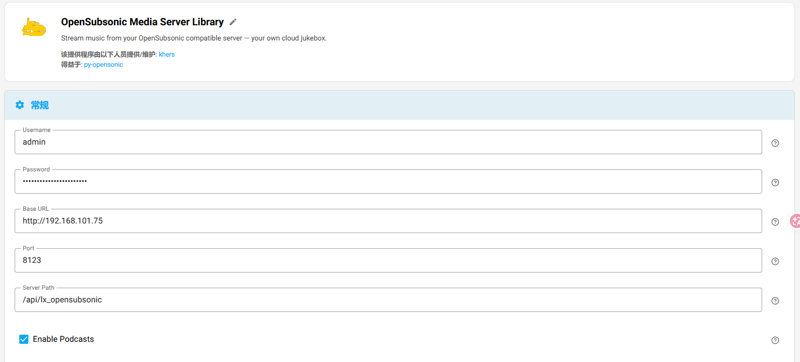
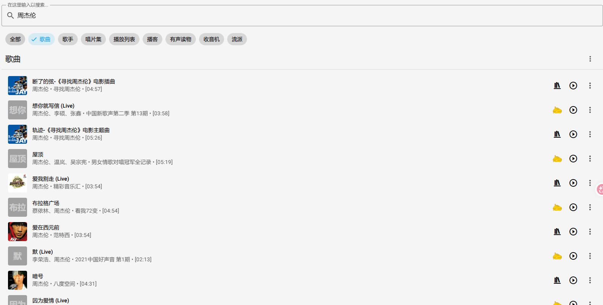
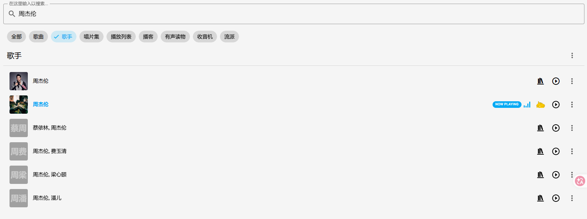
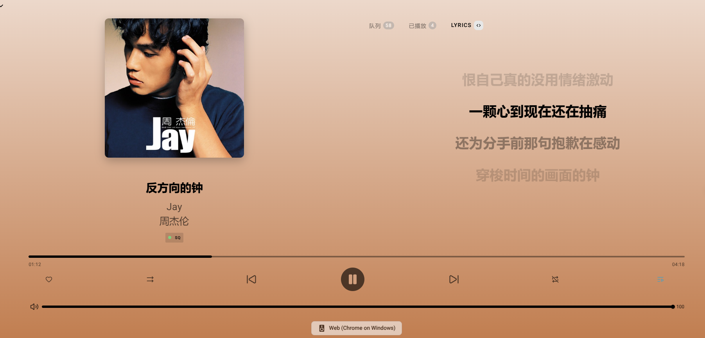

# LX OpenSubsonic

[](https://github.com/hacs/integration)
[](https://github.com/JochenZhou/ha-lx-opensubsonic/releases)

在 Home Assistant 中提供 **OpenSubsonic 兼容接口**，让 **Music Assistant** 搜索并播放在线音乐。

> 本项目修改自 [XCQ0607/lxserver](https://github.com/XCQ0607/lxserver)，以 Home Assistant `custom_component` 方式提供桥接能力。

## 效果预览

### Music Assistant 配置



### 搜索歌曲



### 搜索歌手



### 播放页



## 快速开始

### 1. 安装集成

#### 方式 A：HACS（推荐）

[](https://my.home-assistant.io/redirect/hacs_repository/?owner=JochenZhou&repository=ha-lx-opensubsonic&category=integration)

1. 先安装 [HACS](https://hacs.xyz/)
2. 点击上方按钮，或在 HACS → 集成 → 右上角 ⋮ → **自定义仓库**
3. 仓库地址：

```text
https://github.com/JochenZhou/ha-lx-opensubsonic
```

4. 类别选择 **Integration**
5. 搜索并安装 **LX OpenSubsonic**
6. 重启 Home Assistant
7. 设置 → 设备与服务 → 添加集成 → **LX OpenSubsonic**

#### 方式 B：手动安装

把 `custom_components/lx_opensubsonic` 复制到 Home Assistant 的 `config/custom_components/`，重启后添加集成。

### 2. 配置集成

添加集成时填写：

| 配置项 | 说明 |
|---|---|
| 用户名 / 密码 | 给 Music Assistant 连接使用 |
| 默认搜索源 | 如 `tx`（QQ 音乐） |
| 音源 JS 链接 | 用于解析播放链接（自定义源） |
| 优先音质 | 如 `flac` / `320k` |

安装后可用实体随时切换：

- **默认搜索源**（下拉）
- **优先音质**（下拉）
- **健康状态**（传感器）
- **测试连接**（按钮）
- **歌单导入相关实体**（文本 / 选择 / 按钮）

重新配置菜单仅用于修改：用户名、密码、音源 JS 链接。

### 3. 配置 Music Assistant

在 Music Assistant 中添加 **OpenSubsonic Media Server Library**，按字段填写（与截图一致）：

| 字段 | 示例 |
|---|---|
| Username | 与集成一致，如 `admin` |
| Password | 与集成一致 |
| Base URL | `http://<你的HA地址>` |
| Port | `8123` |
| Server Path | `/api/lx_opensubsonic` |

说明：

- 实际 REST 入口为：`http://<HA>:8123/api/lx_opensubsonic/rest/...`
- 若你的 MA 版本把路径拆成 `Base URL + Port + Server Path`，请按上表填写
- 若版本只有一个 Base URL 字段，可写：`http://<HA>:8123/api/lx_opensubsonic`

## 支持功能

- 在线搜索：歌曲 / 专辑 / 歌手
- 播放取链（通过音源 JS / 自定义源）
- 封面显示
- 多搜索源：`tx` / `wy` / `kg` / `kw` / `mg`
- 音质选择
- 健康状态传感器与测试连接按钮
- **手动导入 QQ 歌单** 到 OpenSubsonic 播放列表（供 MA 播放列表使用）

## 歌单导入（手动）

支持通过实体 UI 手动导入 **QQ 音乐歌单**：

1. 填写 `歌单链接或ID`
2. 选择 `歌单平台`（可自动识别）
3. 点击 `导入歌单`
4. 在 Music Assistant 中让歌单进入库（二选一）：
   - **推荐**：浏览 → `OpenSubsonic Media Server Library` → **播放列表** → 点开新歌单一次
   - 或直接 **重启 Music Assistant**

多歌单管理：

- `已导入歌单`：选择当前歌单
- `刷新歌单`：刷新当前选中
- `删除歌单`：删除当前选中

### 明确不支持

- **不支持在线播放列表 / 歌单搜索**
- 不会在搜索结果中映射歌单
- 搜索页不会出现导入歌单

### Music Assistant 注意

- MA「自带播放列表」是本地库缓存；仅点 OpenSubsonic 的 **重载/同步** 往往不会立刻出现新歌单
- 文件夹浏览是实时接口，导入后这里一定能看到；点一下会收进 MA 库
- 导入成功通知里也会附带上述操作提示

## 使用说明

1. 打开 Music Assistant
2. 选择本 OpenSubsonic 音源
3. 搜索歌手或歌名
4. 播放歌曲

若无法播放：

1. 检查音源 JS 链接是否可用
2. 点击集成里的 **测试连接** 按钮
3. 确认 MA 的 Base URL / Port / Server Path / 账号密码是否正确

## 贡献与致谢

- 修改自 [XCQ0607/lxserver](https://github.com/XCQ0607/lxserver)
- 面向 Music Assistant 的 OpenSubsonic 桥接思路参考了 lxserver 的 Subsonic 兼容实现
- 感谢 Music Assistant / OpenSubsonic 生态

## 📄 开源协议

本项目基于 **Apache License 2.0** 许可证发行，以下协议是对于 Apache License 2.0 的补充，如有冲突，以以下协议为准。

Apache License 2.0 copyright (c) 2026 xcq0607

词语约定：本协议中的“本项目”指 **LX OpenSubsonic（HA 集成 / OpenSubsonic 桥接）** 及其相关代码与文档；“使用者”指签署本协议的使用者；“官方音乐平台”指对本项目可对接的包括酷我、酷狗、咪咕、QQ 音乐、网易云等音乐源的官方平台统称；“版权数据”指包括但不限于图像、音频、名字等在内的他人拥有所属版权的数据。

### 一、数据来源

1. **官方平台**  
   本项目的各官方平台在线数据来源原理是从其公开服务器中拉取数据，经过对数据简单地筛选与合并后进行展示（与未登录状态在官方 APP 获取的数据相同），因此本项目不对数据的合法性、准确性负责。

2. **音频数据**  
   本项目本身没有获取某个音频数据的能力，所使用的在线音频数据来源来自设置内“自定义源 / 音源 JS”所选择的“源”返回的在线链接。本项目无法校验其准确性，使用过程中可能会出现播放异常。

3. **其他数据**  
   本项目的非官方平台数据（例如手动导入的歌单列表）来自本地存储数据，本项目不对这些数据的合法性、准确性负责。

### 二、免责声明

1. **版权数据**  
   使用本项目的过程中可能会产生版权数据。对于这些版权数据，本项目不拥有它们的所有权。为了避免侵权，使用者务必在 **24 小时内** 清除使用本项目的过程中所产生的版权数据。

2. **责任承担**  
   由于使用本项目产生的包括由于本协议或由于使用或无法使用本项目而引起的任何性质的任何直接、间接、特殊、偶然或结果性损害由使用者负责。

3. **法律法规**  
   本项目完全免费，且开源发布于 GitHub 面向全世界人用作对技术的学习交流。禁止在违反当地法律法规的情况下使用本项目。对于使用者在明知或不知当地法律法规不允许的情况下使用本项目所造成的任何违法违规行为由使用者承担。

### 三、其他

1. **资源使用**  
   本项目内使用的部分包括但不限于字体、图片等资源来源于互联网。如果出现侵权可联系本项目移除。

2. **非商业性质**  
   本项目仅用于对技术可行性的探索及研究，不接受任何商业（包括但不限于广告等）合作及捐赠。

3. **接受协议**  
   若你使用了本项目，即代表你接受本协议。

完整 Apache License 2.0 文本见仓库根目录 `LICENSE`。
